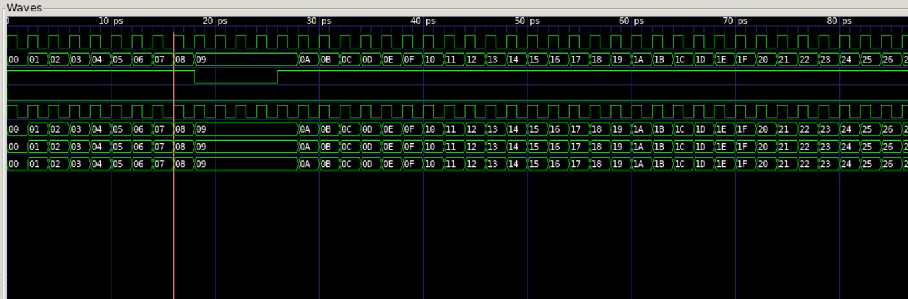
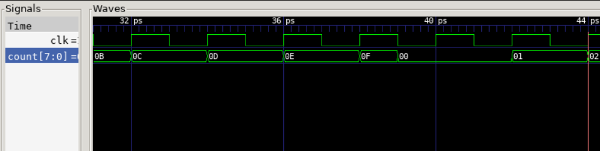

# Task 1 Challenge yourself

## Challenge

1. Modify the testbench so that you stop counting for 3 cycles once the counter reaches 0x9, and then resume counting.  You may also need to change the stimulus for _rst_.

**solution**



This could be achieved by adding the following lines of [codes](counter_tb.cpp#L38) and removing the rst and en stimulus given.

```cpp
top -> en = !(top->count >= 0x9 && i <= 11);
```

2. to add asynchronous reset to the counter

**solution**



add posedge rst to the sensitivity list.
